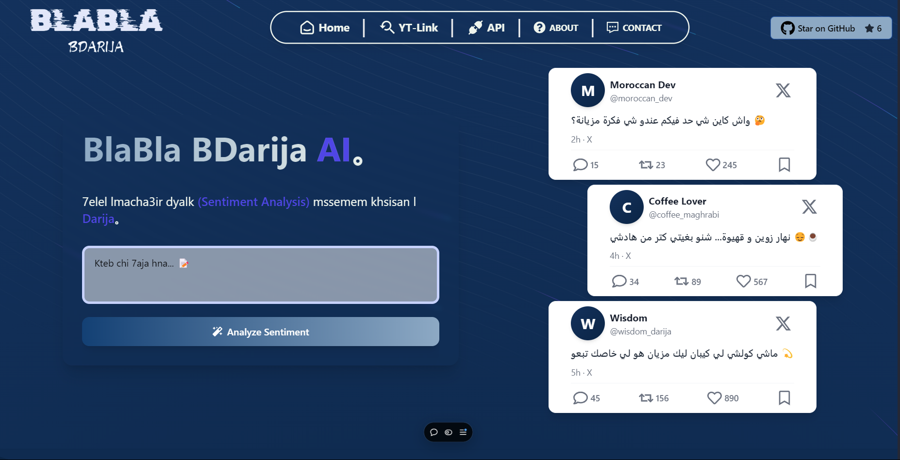
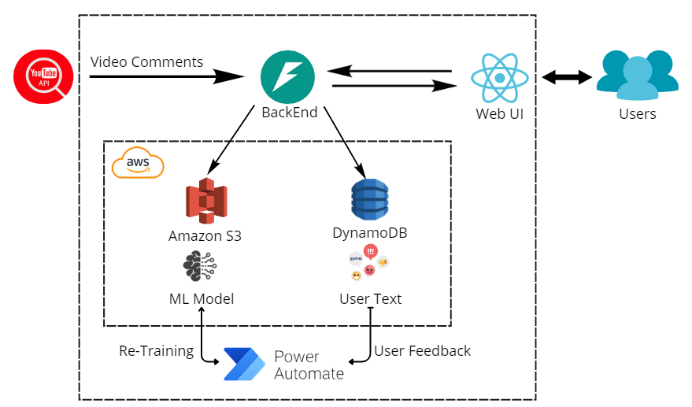

# Darija Sentiment Analysis Platform

## Overview

This project is a sentiment analysis platform specifically designed for Darija (Moroccan Arabic). Users can analyze sentiment by either inputting simple text or providing a YouTube video URL to evaluate the average sentiment of its comments. Developers can also leverage a REST API to integrate the sentiment analysis model into their own applications.

### **Explore the Platform**

Visit the web application to experience the platform in action:  
[**Try it Here**](https://blabla-bdarija.vercel.app)

---

## Architecture

The system is composed of the following components:

### **1. Input Options**

- **Simple Text Input**: Manually input Darija text to analyze its sentiment.
- **YouTube Video URL**: Provide a YouTube video link to analyze the average sentiment of its comments fetched via the YouTube API.
- **REST API**: Access the sentiment analysis model programmatically for integration into external projects.

### **2. Backend Services**

- Built with **FastAPI**, the backend handles:
  - Input processing for text and YouTube comments.
  - Sentiment analysis requests to the machine learning model.
  - Data and feedback storage in DynamoDB.
  - REST API for external integrations.

### **3. Web UI**

- A React.js interface allowing users to:
  - Input text or YouTube URLs for sentiment analysis.
  - View sentiment results (positive or negative).
  - Submit feedback to improve the system.

### **4. Data Storage**

- **DynamoDB**:
  - Stores user-submitted text and feedback for further analysis and model improvement.

### **5. Machine Learning Model**

- A sentiment analysis model trained for Darija, capable of classifying input as **positive** or **negative**.
- Continuously improved through user feedback.

For more information about the model:  
[**Read the Research Paper**](./Documents/Research-Paper.pdf)

---

## Core Features

### **Sentiment Analysis**

- **Darija-Specific**: Optimized for Darija text for high accuracy.
- Analyze sentiment of:
  - Input text.
  - Average sentiment of YouTube video comments.

### **Developer-Friendly API**

- REST API for integrating the Darija sentiment analysis model into external applications.

### **Feedback Loop**

- Users can provide feedback on sentiment predictions.
- Feedback is stored in DynamoDB and used to enhance model performance through re-training.

---

## Tools and Technologies

- **Frontend**: React
- **Backend**: FastAPI
- **Machine Learning**: Custom model trained for Darija sentiment analysis
- **Cloud Services**:
  - **DynamoDB**: To store user inputs and feedback
  - **Amazon S3**: Stores the model (accessible for the app and re-training workflow)
- **Automation**: Feedback-driven re-training workflow using Power Automate

---

## Collaborate with Me

We welcome collaboration to make the **Darija Sentiment Analysis Platform** even better!  

---

## Contact Me:
Feel free to reach out with questions, suggestions, or opportunities to collaborate.  
📧 Email: [mailto:othmanelhadrati@gmail.com](mailto:othmanelhadrati@gmail.com)

Let's work together to advance sentiment analysis for Darija! 🎉
